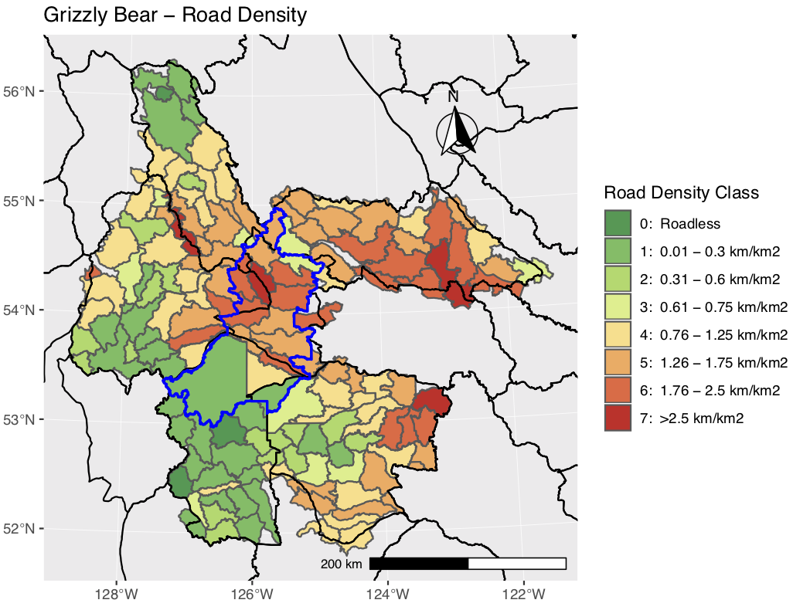
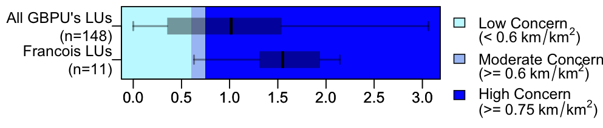

---
output:
  md_document:
    variant: markdown_github
---

<!-- README.md is generated from README.Rmd. Please edit that file -->

```{r, echo = FALSE}
knitr::opts_chunk$set(
  collapse = TRUE,
  comment = "#>",
  fig.path = "README-"
)
```

# Summary of Provincial Grizzly Bear information for an Area of Interest for Integrated Monitoring reporting
Summaries of Provincial Cumulative Effects (CE) Grizzly Bear and Management status ranking data for use in reports. The script generates maps and box plots of indicators. The box plots compare the Landscape Units (LUs) withing an Area of Interest (AOI) with those for all of the intersecting Grizzly Bear Population Units (GBPUs).

### Usage

There are six core scripts that are required for the analysis, the run_all.R script sets the environment variables:

1. 01_load_TSA.R - Data load for AOI

  + TSA provided as an example with download from GeoBC.
  + Requires Provincial Grizzly Bear CE geodatabase, which includes LU summary data and GBPUs. available from Provincial CE program.
  

2. run_all_AOI.R - Identify Area of Interest analysis parameters
  
  + AOI name and GBPUs to consider for the analysis.
  + Set % overlap for LUs that overlap AOI boundary.
  + Identify which CE indicators to consider - main ones are listed, but a subset can be identified.
  + Calls set of R scripts to clean data and run analysis
  - 01_load_TSA.R
  - 02_clean.R
  - 03_analysis_Maps.R
  - 03_analysis_BoxPlots.R - which calls boxplotsGB.R and BoxGB.R
  - 03_analysis_GBPU_Rank.R

### Example Output
The script generates 3 types of output; 1) indicator maps for AOI, 2) box plots comparing AOI LUs with GBPUs LUs, and 3) map of management rank.



### Project Status
This project is under active development.

### Getting Help or Reporting an Issue

To report bugs/issues/feature requests, please file an [issue](https://github.com/bcgov/IM-Report-GBears/issues).

### How to Contribute

If you would like to contribute, please see our [CONTRIBUTING](CONTRIBUTING.md) guidelines.

Please note that this project is released with a [Contributor Code of Conduct](CODE_OF_CONDUCT.md). By participating in this project you agree to abide by its terms.

### License

    Copyright 2017 Province of British Columbia

    Licensed under the Apache License, Version 2.0 (the "License");
    you may not use this file except in compliance with the License.
    You may obtain a copy of the License at 

       http://www.apache.org/licenses/LICENSE-2.0

    Unless required by applicable law or agreed to in writing, software
    distributed under the License is distributed on an "AS IS" BASIS,
    WITHOUT WARRANTIES OR CONDITIONS OF ANY KIND, either express or implied.
    See the License for the specific language governing permissions and
    limitations under the License.
    
This repository is maintained by [ENVEcosystems](https://github.com/orgs/bcgov/teams/envecosystems/members).    

